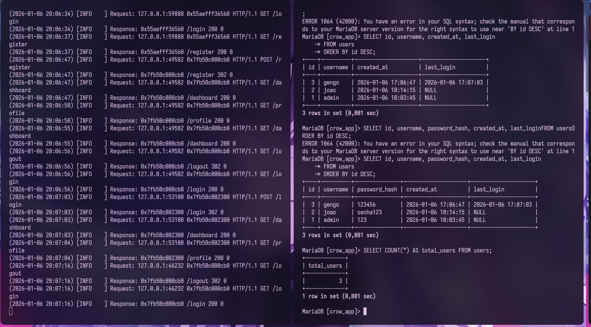
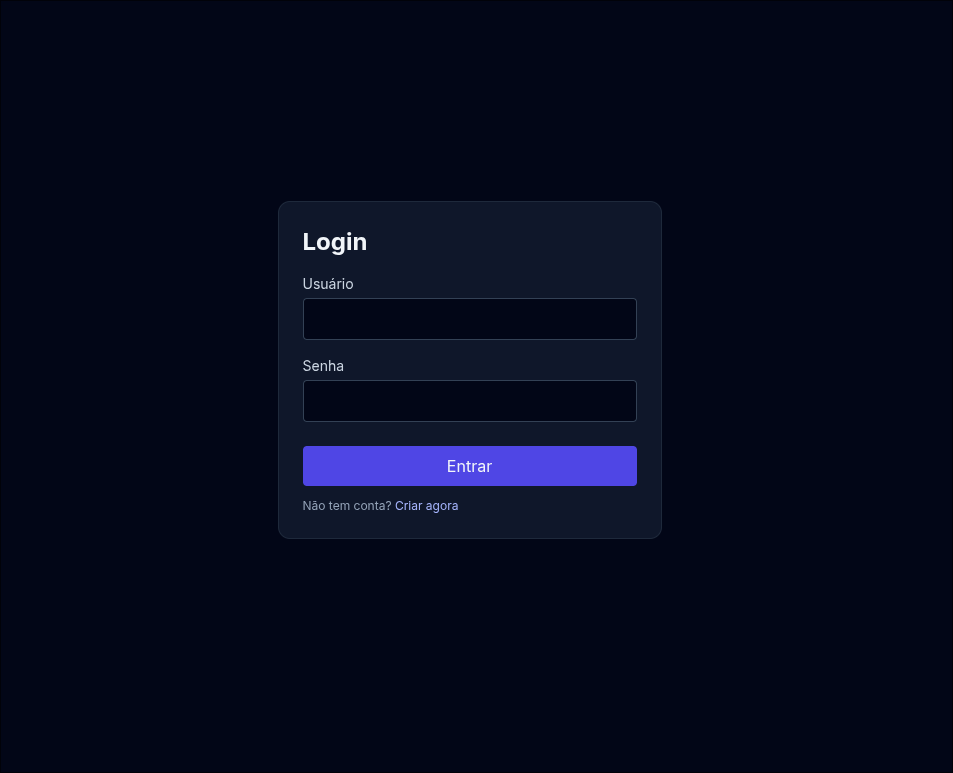
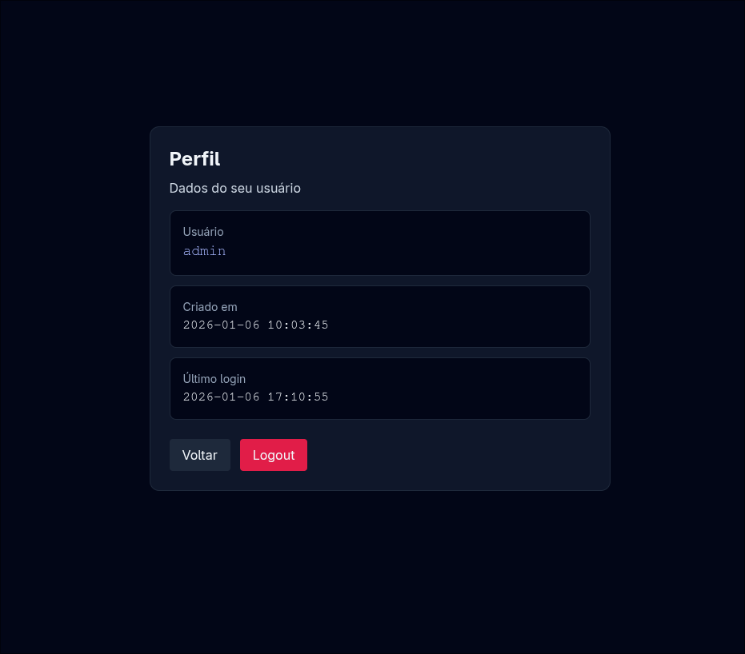

# Crow WebApp (C++20) + MariaDB: Login, Cadastro, Sessões e Perfil

Um mini web app “de portfólio” em **C++20** usando **Crow** + **Mustache templates** + **Tailwind (CDN)**, com **autenticação** e **sessões persistidas no MariaDB** (cookie `sid` + tabela `sessions`).

> Construído com orientação do curso da Udemy: **Curso de C++ Moderno Avançado — Marcos Oliveira**.

---

## ✅ Funcionalidades

- **/register**: cadastro de usuário pelo site (validação + username único).
- **/login**: autentica e cria sessão persistida no banco.
- **Cookie `sid` (HttpOnly)**: o navegador guarda o identificador de sessão.
- **/dashboard** (protegida): só abre com `sid` válido.
- **/profile** (protegida): mostra username, data de cadastro e “último login”.
- **/logout**: encerra sessão no banco e apaga o cookie.

---

## 🧱 Stack

- **C++20**
- **Crow** (HTTP server)
- **Mustache** (render HTML)
- **TailwindCSS via CDN** (sem build)
- **MariaDB** + **libmariadb** (client C)

---

## 📸 Prints (comprovação)

> Para o GitHub renderizar, mantenha as imagens em `docs/`.

### Logs do servidor + consultas no MariaDB


### Página de Login


### Página de Perfil


---

## 🌳 Estrutura do projeto

```txt
app_web_crow_mysql/
├── main.cpp            # bootstrap: cria TodoApp e roda
├── todo.hpp            # classes + interfaces (DB/Auth/Rotas)
├── todo.cpp            # implementação (rotas + SQL + cookies)
├── run.sh              # automação: compila e executa
├── db_sessions.sh      # automação: cria DB/tabelas/usuário do MySQL
├── .env                # (opcional) exports de variáveis (NÃO commitar)
├── static/
│   └── css/
│       └── app.css
├── templates/
│   ├── login.html
│   ├── register.html
│   ├── dashboard.html
│   └── profile.html
└── docs/
    ├── 01_logs_mariadb_e_requests.png
    ├── 02_pagina_login.png
    └── 03_pagina_perfil.png
```

---

## 🚀 Rodando no Arch Linux (passo a passo)

### 1) Dependências

```bash
sudo pacman -S --needed gcc pkgconf mariadb libmariadb
```

> Crow pode ser instalado via AUR (`yay -S crow`) ou incluído como header-only no projeto (dependendo do seu setup).

### 2) Subir o MariaDB

```bash
sudo systemctl enable --now mariadb
systemctl status mariadb --no-pager
```

### 3) Criar banco/tabelas/usuário do app

#### Opção A: usar o script

```bash
chmod +x db_sessions.sh
./db_sessions.sh
```

#### Opção B: criar “na mão” (no console do MariaDB)

Entre no MariaDB:

```bash
sudo mariadb
```

Cole:

```sql
CREATE DATABASE IF NOT EXISTS crow_app CHARACTER SET utf8mb4 COLLATE utf8mb4_unicode_ci;
USE crow_app;

CREATE TABLE IF NOT EXISTS users (
  id BIGINT UNSIGNED NOT NULL AUTO_INCREMENT PRIMARY KEY,
  username VARCHAR(64) NOT NULL UNIQUE,
  password_hash VARCHAR(255) NOT NULL,
  created_at TIMESTAMP NOT NULL DEFAULT CURRENT_TIMESTAMP,
  last_login TIMESTAMP NULL DEFAULT NULL
);

CREATE TABLE IF NOT EXISTS sessions (
  sid CHAR(64) NOT NULL PRIMARY KEY,
  user_id BIGINT UNSIGNED NOT NULL,
  created_at TIMESTAMP NOT NULL DEFAULT CURRENT_TIMESTAMP,
  last_seen TIMESTAMP NOT NULL DEFAULT CURRENT_TIMESTAMP,
  expires_at TIMESTAMP NOT NULL,
  CONSTRAINT fk_sessions_user FOREIGN KEY (user_id) REFERENCES users(id) ON DELETE CASCADE,
  INDEX idx_sessions_user (user_id),
  INDEX idx_sessions_expires (expires_at)
);

CREATE USER IF NOT EXISTS 'crow'@'localhost' IDENTIFIED BY 'aeronave202655';
CREATE USER IF NOT EXISTS 'crow'@'127.0.0.1' IDENTIFIED BY 'aeronave202655';
GRANT ALL PRIVILEGES ON crow_app.* TO 'crow'@'localhost';
GRANT ALL PRIVILEGES ON crow_app.* TO 'crow'@'127.0.0.1';
FLUSH PRIVILEGES;
```

> Migração rápida: se você já tinha uma tabela `users` antiga sem `last_login`:

```sql
ALTER TABLE users ADD COLUMN last_login TIMESTAMP NULL DEFAULT NULL;
```

### 4) Variáveis de ambiente (config do DB)

O app lê:

- `CROW_DB_HOST`
- `CROW_DB_PORT`
- `CROW_DB_USER`
- `CROW_DB_PASS`
- `CROW_DB_NAME`

#### Export no terminal

```bash
export CROW_DB_HOST=127.0.0.1
export CROW_DB_PORT=3306
export CROW_DB_USER=crow
export CROW_DB_PASS='aeronave202655'
export CROW_DB_NAME=crow_app
```

#### Usando `.env` (mais organizado)

Crie `.env` (não commite!):

```bash
cat > .env <<'EOF'
export CROW_DB_HOST=127.0.0.1
export CROW_DB_PORT=3306
export CROW_DB_USER=crow
export CROW_DB_PASS='aeronave202655'
export CROW_DB_NAME=crow_app
EOF
```

Depois carregue:

```bash
source .env
```

E coloque no `.gitignore`:

```gitignore
.env
```

### 5) Compilar e rodar

#### Script (recomendado)

```bash
chmod +x run.sh
./run.sh
```

O script geralmente:
- compila `main.cpp + todo.cpp`
- linka `libmariadb` via `pkg-config`
- gera `./app`
- inicia em `http://localhost:18080`

#### Manual

```bash
g++ -std=c++20 main.cpp todo.cpp -O2 -pthread $(pkg-config --cflags --libs libmariadb) -o app
./app
```

---

## 🗃️ Banco de dados: como ver usuários e sessões

Entre no MariaDB:

```bash
sudo mariadb
```

Depois:

```sql
USE crow_app;
SHOW TABLES;

SELECT id, username, created_at, last_login
FROM users
ORDER BY id DESC;

SELECT sid, user_id, created_at, last_seen, expires_at
FROM sessions
ORDER BY created_at DESC
LIMIT 20;
```

### Limpando dados (sem dor com FK)

```sql
USE crow_app;
TRUNCATE TABLE sessions;
DELETE FROM users;
```

---

## 🍪 Cookie `sid`: o que é e por que funciona

Quando você faz login:
1) o servidor cria um `sid` aleatório
2) grava no banco (`sessions.sid`, com `expires_at`)
3) responde com `Set-Cookie: sid=...; HttpOnly; SameSite=Lax; Path=/; Max-Age=...`

Nas páginas protegidas (`/dashboard`, `/profile`), o servidor:
- lê o cookie `sid`
- busca no banco
- valida se existe e se não expirou

---

## 🔐 Segurança (estado do MVP)

### As senhas estão protegidas?
**Ainda não do jeito ideal.**

Apesar do campo se chamar `password_hash`, este MVP salva **texto puro** (intencional para simplificar o fluxo). Em produção, o correto é:
- salvar **hash forte** (Argon2id/bcrypt)
- nunca armazenar/exibir senha
- usar HTTPS

> Upgrade recomendado imediato: trocar para Argon2id/bcrypt.

---

## 🧩 O que cada script faz

### `run.sh`
- automatiza build + execução
- evita esquecer flags (`-pthread`, `pkg-config libmariadb`)

### `db_sessions.sh`
- cria `crow_app`
- cria tabelas `users`/`sessions`
- cria usuário `crow` e dá privilégios

---

## Créditos

- Udemy: **Curso de C++ Moderno Avançado — Marcos Oliveira** (orientação)
- Framework HTTP: **Crow**
- DB: **MariaDB**
